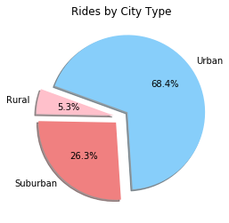

# python-ridesharing-analysis

## Seeing the success of notable players like Uber and Lyft, you've decided to join a fledgling ride sharing company of your own. In your latest capacity, you'll be acting as Chief Data Strategist for the company. In this role, you'll be expected to offer data-backed guidance on new opportunities for market differentiation.

You've since been given access to the company's complete recordset of rides. This contains information about every active driver and historic ride, including details like city, driver count, individual fares, and city type.

From the data we can glean a few insights:
1. Most drivers are from an Urban city type.
2. Rural areas have higher fares, likely because of distances between locations.
3. Most of the rides and fares are coming from an Urban city type.


## Pyber - Pablo


```python
%matplotlib inline
# Dependencies and Setup
import matplotlib.pyplot as plt
import pandas as pd
import numpy as np
city = "data/city_data.csv"
ride = "data/ride_data.csv"
dfc = pd.read_csv(city)
dfr = pd.read_csv(ride)
df = pd.merge(dfc, dfr, how = 'outer', on='city')
df.to_csv('merged.csv')
df.dropna()
df.head()
```


<div>
<style scoped>
    .dataframe tbody tr th:only-of-type {
        vertical-align: middle;
    }

    .dataframe tbody tr th {
        vertical-align: top;
    }

    .dataframe thead th {
        text-align: right;
    }
</style>
<table border="1" class="dataframe">
  <thead>
    <tr style="text-align: right;">
      <th></th>
      <th>city</th>
      <th>driver_count</th>
      <th>type</th>
      <th>date</th>
      <th>fare</th>
      <th>ride_id</th>
    </tr>
  </thead>
  <tbody>
    <tr>
      <th>0</th>
      <td>Richardfort</td>
      <td>38</td>
      <td>Urban</td>
      <td>2018-02-24 08:40:38</td>
      <td>13.93</td>
      <td>5628545007794</td>
    </tr>
    <tr>
      <th>1</th>
      <td>Richardfort</td>
      <td>38</td>
      <td>Urban</td>
      <td>2018-02-13 12:46:07</td>
      <td>14.00</td>
      <td>910050116494</td>
    </tr>
    <tr>
      <th>2</th>
      <td>Richardfort</td>
      <td>38</td>
      <td>Urban</td>
      <td>2018-02-16 13:52:19</td>
      <td>17.92</td>
      <td>820639054416</td>
    </tr>
    <tr>
      <th>3</th>
      <td>Richardfort</td>
      <td>38</td>
      <td>Urban</td>
      <td>2018-02-01 20:18:28</td>
      <td>10.26</td>
      <td>9554935945413</td>
    </tr>
    <tr>
      <th>4</th>
      <td>Richardfort</td>
      <td>38</td>
      <td>Urban</td>
      <td>2018-04-17 02:26:37</td>
      <td>23.00</td>
      <td>720020655850</td>
    </tr>
  </tbody>
</table>
</div>


## Bubble Plot of Ride Sharing Data


```python
# Obtain the x and y coordinates for each of the three city types
# Build the scatter plots for each city types
# Incorporate the other graph properties
# Create a legend
# Incorporate a text label regarding circle siz
# Save Figure

urban = df[df["type"] == "Urban"].groupby([df["city"]])
rural = df[df["type"] == "Rural"].groupby([df["city"]])
suburban = df[df["type"] == "Suburban"].groupby([df["city"]])
x_urban = urban["ride_id"].count()
y_urban = urban["fare"].mean()
s_urban = urban["driver_count"].mean()
x_rural = rural["ride_id"].count()
y_rural = rural["fare"].mean()
s_rural = rural["driver_count"].mean()
x_suburban = suburban["ride_id"].count()
y_suburban = suburban["fare"].mean()
s_suburban = suburban["driver_count"].mean()

plt.scatter(x_urban, y_urban, s_urban*3,
            label = "Urban", color=["pink"], edgecolor="red", alpha = 0.75, marker="o")
plt.scatter(x_rural, y_rural, s_rural*3,
            label = "Rural", color=["lightgreen"], edgecolor="green", alpha = 0.75, marker="o")
plt.scatter(x_suburban, y_suburban,s_suburban*3,
            label = "Suburban", color=["lightblue"], edgecolor="blue", alpha = 0.75, marker="o")
plt.grid()

# Incorporate the other graph properties
plt.xlabel("Rides by City Type", fontsize =12)
plt.ylabel("Avg Fare", fontsize =12)
plt.title("Pyber Ride Sharing Data (2016)", fontsize =12)

legend = plt.legend(fontsize = 12, title= "City Types", loc="best") 
plt.text(43,15,"Note: \nCircles sized by \ndriver count per city.", fontsize = 12)

plt.savefig("pyber_bubble.png", bbox_inches="tight")
plt.show()
```


## Total Fares by City Type


```python
# Calculate Type Percents
# Build Pie Chart
# Save Figure
total = df.groupby(['type'])
fare_sum = total['fare'].sum()
labels = ["Rural","Suburban","Urban"]
explode = (0.1, 0.1, 0.1)
colors = ["pink", "lightcoral", "lightskyblue"]
plt.pie(fare_sum, explode = explode, labels = labels,
        colors = colors, autopct = "%1.1f%%", shadow = True, startangle = 160)
plt.title("Fares by City Types")
plt.savefig("fares_pie.png")
plt.show()
```


## Total Rides by City Type


```python
# Calculate Ride Percents
# Build Pie Chart
# Save Figure
rides_count = total['ride_id'].count()
labels = ["Rural","Suburban","Urban"]
explode = (0.1, 0.1, 0.1)
colors = ["pink", "lightcoral", "lightskyblue"]
plt.pie(rides_count, explode=explode, labels=labels,
        colors=colors, autopct="%1.1f%%", shadow=True, startangle=160)
plt.title("Rides by City Type")
plt.savefig("rides_pie.png")
plt.show()
```





## Total Drivers by City Type


```python
# Calculate Driver Percents
# Build Pie Charts
# Save Figure
# Calculate Type Percents
drivers = df.groupby(['type'])
drivers_sum = drivers['driver_count'].sum()
labels = ["Rural","Suburban","Urban"]
explode = (0.1, 0.1, 0.2)
colors = ["pink", "lightcoral", "lightskyblue"]
plt.pie(drivers_sum, explode=explode, labels=labels,
        colors=colors,autopct="%1.1f%%", shadow=True, startangle=160)
plt.title("Drivers by City Type")
plt.savefig("drivers_pie.png")
plt.show()
```


